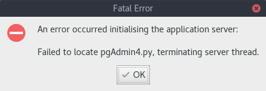
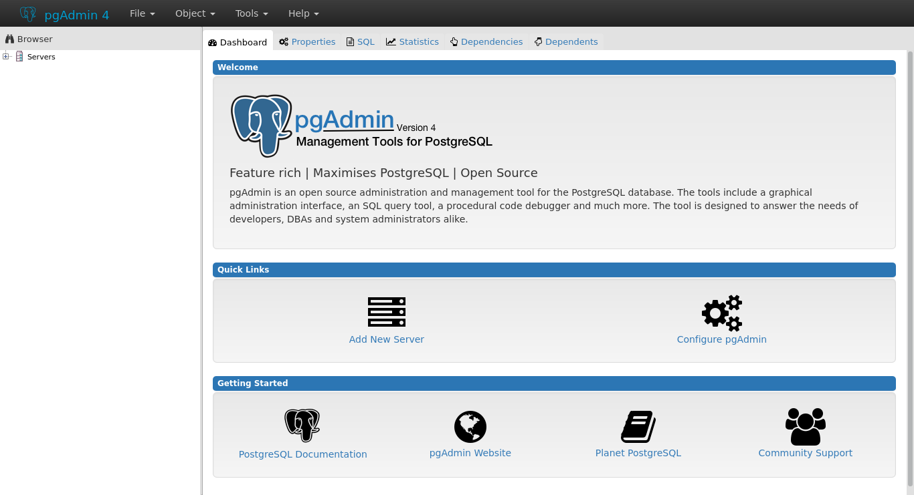

After a install a rpm for the postgres repository, then install pgAdmin4 using dnf.

```shell
sudo dnf install pgAdmin4-v1
```

But when opening the application, there was an error:



A simple workaround is:

- Create folder:
```shell
mkdir ~/.config/pgAdmin\ Development\ Team
```

- Create a config file:

    (change vim with your editor)
```shell
vim ~/.config/pgAdmin\ Development\ Team/pgAdmin\ 4.conf
```

- Insert into the file :

```ini
[General]
ApplicationPath=../../../usr/lib/python3.5/site-packages/pgadmin4-web
PythonPath="/usr/lib/python3.5/site-packages;/usr/lib64/python3.5/site-packages;"
```


