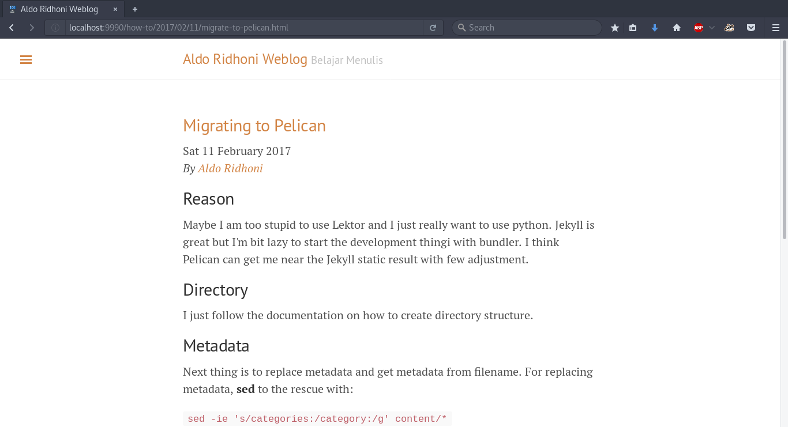

## Reason
Maybe I am too stupid to use Lektor and I just really want to use python. Jekyll is great but I'm bit lazy to start the development thingi with bundler. I think Pelican can get me near the Jekyll static result with few adjustment.

## Directory
I just follow the documentation on how to create directory structure.

## Metadata
Next thing is to replace metadata and get metadata from filename.
For replacing metadata, __sed__ to the rescue with:

`sed -ie 's/categories:/category:/g' content/*`

`sed -ie 's/\'How-To\'/How-To/g' content/*`

`sed -ie 's/\'Story\'/Story/g' content/*`

`sed -ie 's/(/public/({static}/public/g' content/*`

Getting metadata from filename achived using settings in pelicanconf.py

## URL
adjusting the url using metadata from filename

`FILENAME_METADATA = '(?P<date>\d{4}-\d{2}-\d{2})-(?P<slug>.*)'`

## Themes
Still using the same theme by poole.

Screenshot:

