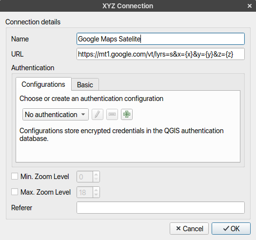

As the title suggest, in this post I will tell the steps to use Google Maps in Mapping Application [QGIS](https://www.qgis.org/en/site/forusers/download.html "QGIS download page"). QGIS is an FOSS application for Geographic Information System similar to commercial ArcGIS software.

In QGIS there is a feature to add XYZ Tiles as a layer.  
Right click on XYZ Tiles from Browser panel and choose "New connection...".  

Add name "Google Satellite".  
Add URL : `https://mt1.google.com/vt/lyrs=s&x={x}&y={y}&z={z}`  
Uncheck max and min zoom level.  
And click OK to create layer.  

[![qgis][smaller]][link]

Now you can use Google Satellite map as your basemap in QGIS. For other types of map from Google Maps see links below.

References :

  - [Adding Basemap from google on stackexchange](https://gis.stackexchange.com/questions/20191/adding-basemaps-from-google-or-bing-in-qgis)
  - [Google Maps tile URL on stackoverflow](https://stackoverflow.com/questions/23017766/google-maps-tile-url-for-hybrid-maptype-tiles/33023651#33023651)

[smaller]: qgiswithgooglemapslayer.png
[link]: qgiswithgooglemapslayer.png (click to enlarge)
