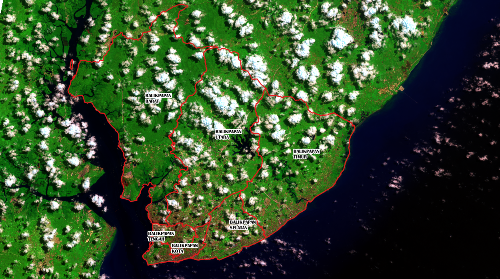
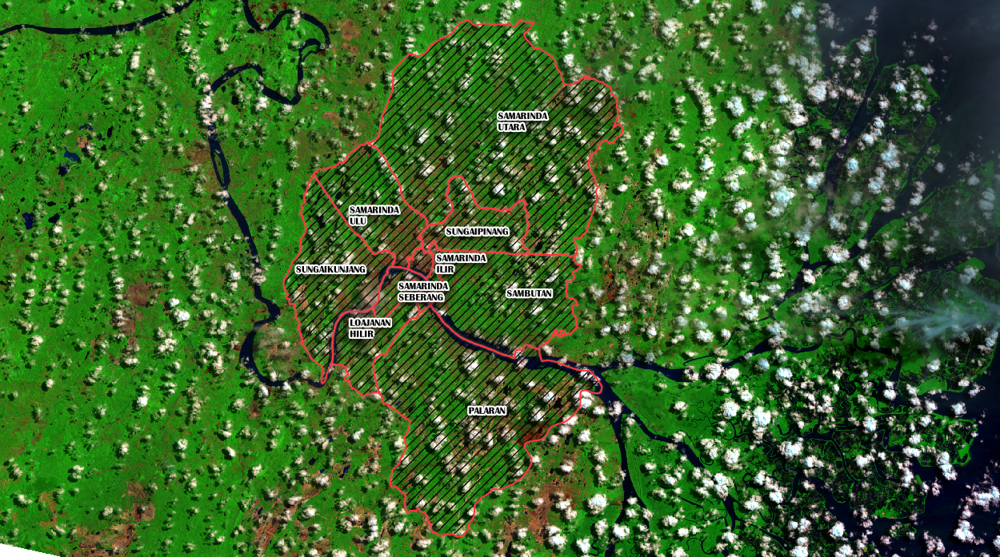

Selamat kepada pemerintah Provinsi Kalimantan Timur, pemerintah Kabupaten PPU & Kabupaten Kutai Kartanegara yang sebagian daerahnya ditetapkan menjadi daerah ibukota yang baru. Menurut pengamatan penulis, kecamatan utama yang dimaksud adalah Kecamatan Sepaku di PPU dan Kecamatan Samboja di KuKar. Walaupun nantinya kalau telah jadi undang-undang/revisi -nya mengenai wilayah ibukota pemerintahan baru ini, sekiranya akan dibuat daerah baru yang mengambil wilayah dari kecamatan-kecamatan tersebut dengan nama baru pula.

Kalau melihat kebelakang (*retrospect*), pembangunan jalan tol Balikpapan-Samarinda yang diharapkan dapat diresmikan akhir tahun ini merupakan nilai tambah dalam terpilihnya Kalimantan Timur. Penulis sebagai warga lokal merasa dinamika dua kota besar itu juga merupakan sesuatu yang unik di Indonesia. Dua kota besar dengan nilai dan kekuatan yang berbeda dalam jarak yang relatif dekat. Apalagi melihat sejarah besar Kerajaan Kutai di sepanjang sungai Mahakam dan perkembangan kilang minyak Pertamina di pinggiran pantai Balikpapan yang menarik pekerja dari luar pulau kalimantan. Pelajaran menarik dalam ilmu antropologi dan sosiologi yang penulis bukanlah ahlinya.

Dalam berita jalan tol Balikpapan-Samarinda, telah direncanakan untuk dilanjutkan arah utara ke Kota Bontang dengan tambahan +-90 KM. Sepertinya akan dibuatkan jembatan tol yang melewati Sungai Mahakam. Menjadi hal yang menarik untuk dipantau perkembangan jalan tol ini, setelah penunjukan ibukota baru di Kalimantan Timur. Sebaliknya untuk arah selatan apakah tol ini akan melewati selat Balipapan via pulau Balang dan ditembuskan ke daerah Provinsi Kalimantan Selatan. Mungkin, 30 tahun lagi.
