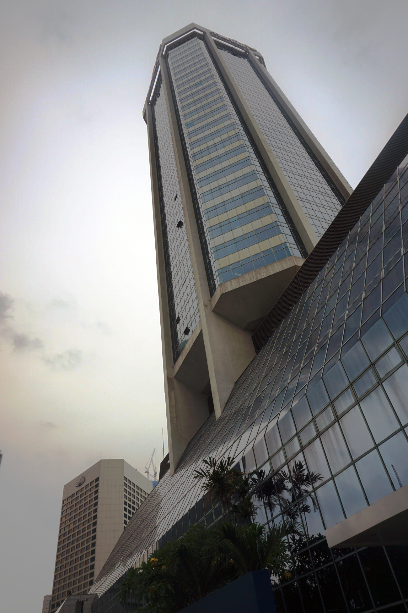

Sertifikasi CCNA RS adalah sertifikasi yang dikeluarkan oleh Cisco kepada individu yang telah berhasil menyelesaikan ujian online (exam) dengan skor diatas batas kelulusan.
CCNA RS yang saya ikuti adalah versi ketiga dengan nomer ujian 200-125. CCNA RS ini membahas ilmu jaringan dan konfigurasi perangkat jaringan Cisco, khususnya *switching* dan *routing*.

Setelah mengikuti pelatihan di IDN yang berlangsung selama 4 hari, saya mendaftar ujian di Integrasindo. Ujian dilaksanakan pada tanggal 16 Desember 2019 di Gedung Graha Mandiri, Jakarta Pusat. 
Pertama datang di gedung, saya diberikan tanda pengenal pengunjung yang ditukar dengan kartu identitas. Naik lift ke lantai atas dan belok kiri, kemudian bertemu dengan sang admin Pak Hendra.
Sebelum ujian saya difoto dan dimintai tanda tangan untuk dapat memulai ujian.

Masuk ke ruang ujian terdapat locker untuk menyimpan semua barang-barang termasuk yang ada dikantong baju dan celana. Dimeja disediakan kertas bergaris yang telah dilaminating dan spidol untuk corat-coret. Sebelum memulai ujiannya, diberikan tutorial tata cara ujian langsung di komputer. Ujian terdiri dari 62 soal dengan durasi 120 menit. Terdapat 3 soal simulasi. Setelah selesai, nilai langsung keluar dan skor saya dinyatakan lulus.

