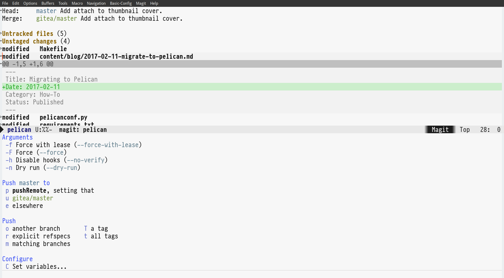
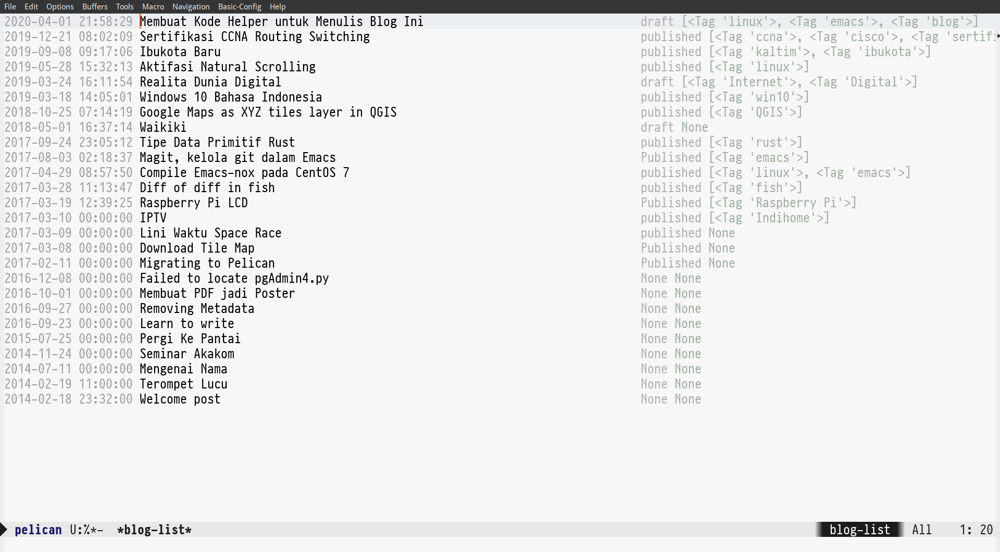

Setelah kembali bergelut dengan teks editor [Emacs](https://www.gnu.org/software/emacs/download.html) dan masih dalam suasana karantina, saya ingin mencoba lebih aktif untuk menulis di blog ini.
Setelah membaca blog [Lars Ingebrigtsen](https://lars.ingebrigtsen.no/2018/10/02/editing-wordpress-articles-in-emacs/) tentang project [ewp](https://github.com/larsmagne/ewp) yang membuat dia dapat mengedit post Wordpress-nya langsung dari Emacs.
Melihat apa yang mungkin, saya langsung mencoba membuat kode *helper* untuk blog saya.

Blog ini adalah blog dengan tipe static, yang berarti hasil akhir dari proses menulisnya hanya berupa file HTML, CSS, JS dan gambar. Saya menulis post ini dalam teks berformat **Markdown**.
Saya menggunakan **Pelican** sebagai aplikasi pengolahnya. Aplikasi Pelican sendiri ditulis dalam bahasa pemrograman **Python**.

Berikut *workflow* saya ketika akan membuat satu post di blog ini:

1. Buka aplikasi terminal
2. Ubah ke folder blog, nyalakan python virtual environment.
3. Panggil *make newpost* untuk membuat post baru.
4. Edit file markdown.
5. Copy file gambar jika diperlukan.
6. Nyalakan server lokal dan lihat hasilnya di browser.
7. Lakukan *git commit* untuk menyimpan perubahan.
8. Push ke **Microsoft Github** untuk disimpan dan ditayangkan.

## Lakukan semua dalam Emacs ##

Dengan prinsip semua bisa dilakukan dalam Emacs, saya menulis *emacs-helper.el* untuk blog saya ini. 
Berekstensi el karena ditulis dalam bahasa pemrograman Emacs Lisp. 

### Fungsi Kompilasi ###
Hal pertama yang saya lakukan adalah membuat fungsi untuk memanggil program *make* dari emacs. 
Emacs memiliki fungsi *compile* yang saya bungkus dalam fungsi baru.

```emacs-lisp
    (defun blog/call-make (operation)
        "Call make program with OPERATION."
        (interactive "sPerintah: ")
        (blog/activate-venv)
        (let ((default-directory blog-base-folder))
             (compile (concat "make" " " operation))))

    (defun blog/activate-venv ()
        "Call pyvenv."
        (pyvenv-activate (file-name-as-directory
                    (concat blog-base-folder "venv"))))
```

Saya menggunakan paket pyvenv untuk mengaktifkan python environment dalam folder blog.

### Fungsi Buat Post Baru ###
Untuk mempermudah membuat post baru, saya menulis fungsi yang memasukan metadata yang diperlukan kedalam file Markdown.


```emacs-lisp
    (defun blog/new-post (title)
        "Create new blog post with TITLE."
        (interactive "sJudul Post: ")
        (let* ((buffer-name (concat (blog/slugify title) ".md"))
               (buffer (generate-new-buffer buffer-name))
               (date (format-time-string "%Y-%m-%d"))
               (now (format-time-string "%Y-%m-%d %H:%M:%S"))
               (dir (concat blog-content-folder "blog/" date))
               (cat-choices '("Story" "Opinion" "How-To" "How Things Work" "Review"))
               (category (completing-read "Pilih Kategori: " cat-choices))
               (tags (read-string "Apa saja tag-nya, pisah pakai koma: ")))
          (unless (file-exists-p dir)
            (make-directory dir))
          (switch-to-buffer buffer)
          (markdown-mode)
          (insert "---\n"
                   "Title: " title"\n"
                   "Slug: "(blog/slugify title)"\n"
                   "Date: " now "\n"
                   "Status: draft\n"
                   "Category: " category "\n"
                   "Tags: " tags "\n"
                   "---\n\n")
          (setq-local default-directory (file-name-as-directory dir))))
```

### Fungsi Server Lokal ###
Untuk server lokal saya gunakan modul bawaan python3 yaitu `http.server`

```emacs-lisp
    (defun blog/start-server (&optional build)
      "Call python subprocess on output dir.
    If BUILD is non nil, clean and regenerate."
      (interactive)
      (when build
        (blog/call-make "clean")
        (blog/call-make "regenerate"))
      (setq blog-server-process
            (start-process "blog-server" "*blog-server*"
                           "python3" "-m" "http.server" "-d"
                           blog-output-folder))
      (switch-to-buffer "*blog-server*")
      (blog/browse-in-eww))
    
    (defun blog/stop-server ()
      "Stopping the server."
      (interactive)
      (when (member blog-server-process (process-list))
        (set-process-query-on-exit-flag blog-server-process nil)
        (stop-process blog-server-process)
        (kill-process blog-server-process)
        (kill-buffer (process-buffer blog-server-process))
        (setq blog-server-process nil)))
```


### Magit Keren ###
Seperti dalam post blog saya mengenai [Magit](/how-to/2017/08/03/magit-kelola-git-dalam-emacs.html), saya menggunakan Magit untuk mengelola git untuk blog ini.

[](magit-screenshot.png)

### Daftar Post ###
Mengambil ide dan kode dari modul emacs *elfeed*, saya membuat daftar post yang ada di blog ini. 

[](list-screenshot.png)

Berikut sebagian potongan kode untuk menampilkan daftar post.

```emacs-lisp
    (defun blog/list-buffer ()
      "Return blog-list buffer."
      (get-buffer-create "*blog-list*"))
    
    (defun blog/list ()
      "Listing available blog posts."
      (interactive)
      (blog/activate-venv)
      (switch-to-buffer (blog/list-buffer))
      (blog-list-mode)
      (blog/list--update)
      (goto-char (+ 20 (point-min))))
```

Kode berikut untuk mengambil metadata dari setiap post yang ada.

```python
    import pelican
    import sys
    import datetime
    
    settings = {"MARKDOWN": {}, "FORMATTED_FIELDS": []}
    re = pelican.readers.MarkdownReader(settings)
    content, metadata = re.read(sys.argv[1])
    
    metadata = pelican.readers._filter_discardable_metadata(metadata)
    
    timestamp = datetime.datetime.strptime(
        metadata.get("date").isoformat(), "%Y-%m-%dT%H:%M:%S").timestamp()
    
    print(metadata.get("title"))
    print(metadata.get("date").isoformat(" "))
    print(metadata.get("status"))
    print(metadata.get("category"))
    print(metadata.get("tags"))
    print(timestamp)
```

### Refleksi Proyek ###
Modul helper ini akan selalu menjadi WIP (*work in progress*) yang akan bertambah sesuai kebutuhan saya dalam menulis blog. Semoga tidak menghilangkan fokus untuk tetap terus menulis dalam blog ini.

Sekian cerita saya mengenai helper ini, terima kasih telah membaca.
