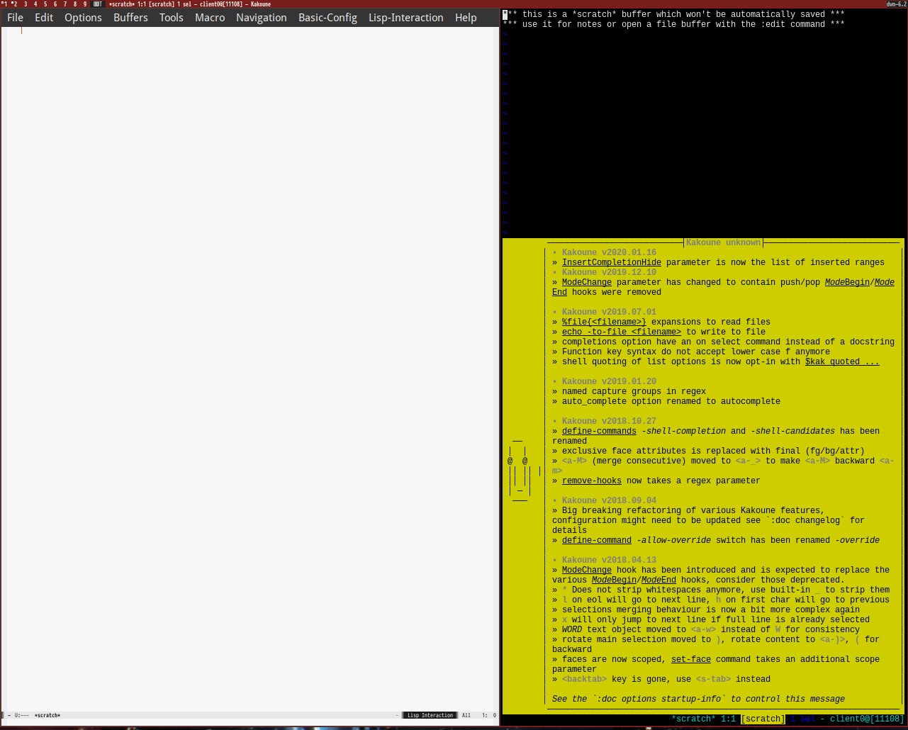

Xephyr adalah program pengganti xnest yang bekerja mengemulasi x server. Xephyr dapat mempercepat proses meninjau perubahan pada program x11.


Install pada Fedora system:

```shell
$ sudo dnf install xorg-x11-server-Xephyr
```    
    
Untuk menjalankan Xephyr:

```shell
$ Xephyr -screen 1280x1024 :1
```    

Xephyr dijalankan dengan ukuran window 1280x1024 pixel dan display :1.
Kemudian tampilkan window manajer atau aplikasi lain didalam Xephyr.

```shell
$ DISPLAY=:1 dwm
$ DISPLAY=:1 GTK_THEME=Adwaita emacs -mm
```


[](xephyr.png)
