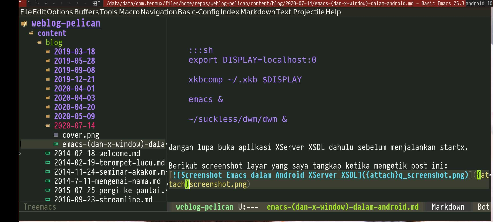

## Abstrak
Persentase penggunaan gadget terutama Smartphone yang tinggi dan 
pergeseran paradigma sebagai komputer portable yang makin tahun makin canggih hingga melebihi spek laptop standar, banyak yang berharap untuk lebih produktif dalam penggunaanya.

Salah satu contoh fitur yang ada di Samsung Galaxy adalah DeX (Desktop eXperience). DeX membuat smartphone berubah menjadi seperti PC Desktop ketika di pasangkan ke Dock yang terhubung dengan papantuts (keyboard) dan tetikus (mouse).

## Android
Dengan adanya aplikasi Termux sebagai chroot sistem GNU/Linux dan adanya X Server berbasis SDL (Simple DirectMedia Layer), kini memungkinkan smartphone Android untuk dipasang program-program linux bahkan sampai full Distro seperti Debian, Kali dan lain-lain.

Aplikasi yang dibutuhkan:

 - Termux di [Play Store](https://play.google.com/store/apps/details?id=com.termux)
 - XServer XSDL di [Play Store](https://play.google.com/store/apps/details?id=x.org.server)
 
### Repository
Pertama-tama kita aktfikan repository x11.

```shell
$ pkg install x11-repo
```
    
Dalam repository ini berisi library dan program-program yang menggunakan tampilan GUI. Salah satu yang akan kita pasang adalah paket `emacs-x`.

```sh
$ pkg install emacs-x
```


Selanjutnya kita butuh Window Manager. Ada beberapa paket WM seperti `dvtm`, `dwm`, `fluxbox`, `fvwm`,`i3`, `openbox`, `xfwm4` dan `xorg-twm`. Karena saya kompilasi sendiri program `dwm`, saya harus hunting beberapa paket library yang dibutuhkan dari halaman Microsoft Github repo termux-x11.

### Keyboard

Karena real-estate layar yang kecil, on-screen keyboard atau keyboard di layar menurut saya kurang bagus. Saya menggunakan keyboard bluetooth Logitech K380.
Ada permasalahan muncul ketika saya ingin mengubah ModKey untuk digunakan dalam `dwm` dengan tombol Alt Kanan atau Alt_R. Saat ini Termux belum ada `xmodmap`, jadi saya gunakan solusi `xkbcomp`. Dump xkb ke file .xkb.

```sh
$ xkbcomp -xkb $DISPLAY ~/.xkb
```
     
Kemudian buka file .xkb dengan teks editor dan coba ganti mod3 menjadi Alt_R.

```text
modifier_map Mod3 { <RALT> };
```    

Untuk membaca file .xkb gunakan perintah:

```sh
xkbcomp ~/.xkb $DISPLAY
```     
     
     
### Hasil
Dikarenakan masih belum ada program `startx` di Termux, saya buat sendiri script startx yang berisi:

```shell
export DISPLAY=localhost:0
xkbcomp ~/.xkb $DISPLAY
     
emacs &
     
~/suckless/dwm/dwm &
```

Jangan lupa buka aplikasi XServer XSDL dahulu sebelum menjalankan startx.

Berikut screenshot layar yang saya tangkap ketika mengetik post ini:
[](screenshot.jpg)
