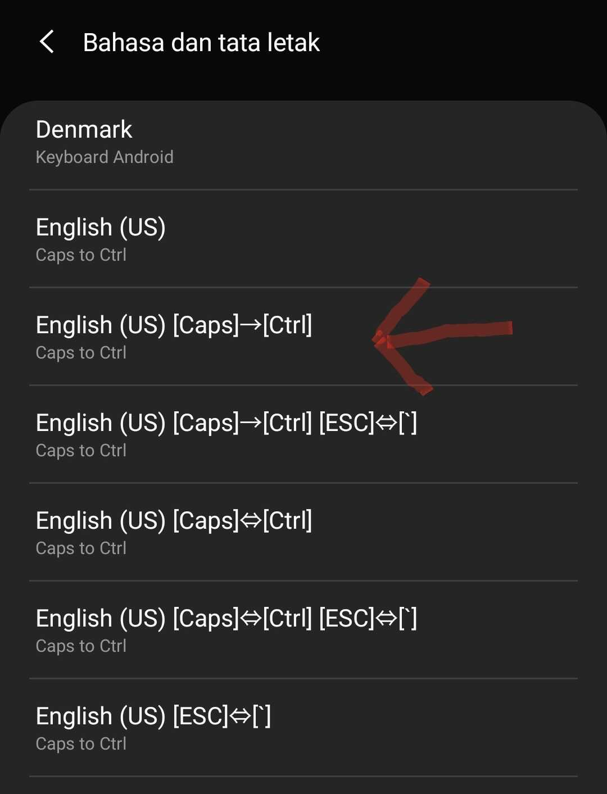

Caps2Ctrl dapat digunakan untuk mengubah tombol Caps Lock menjadi Ctrl di Android. Pertama unduh file `jpkcm-tcen-release-1.4.apk` dari [github.com/shiftrot/caps2ctrl/releases](https://github.com/shiftrot/caps2ctrl/releases/download/v1.4/jpkcm-tcen-release-1.4.apk). File tersebut bahasa Inggris dan yang lainnya pakai bahasa Jepang.

Setelah aplikasi berhasil dipasang, langsung saja ikuti arahan dari dalam catatan aplikasi. Intinya aktifkan keyboard layout yang baru dipasang.

Setelah dipilih Caps akan menjadi Ctrl. Jika ingin membalikan seperti semula tinggal pilih yang English, Inggris atau Indonesia.
