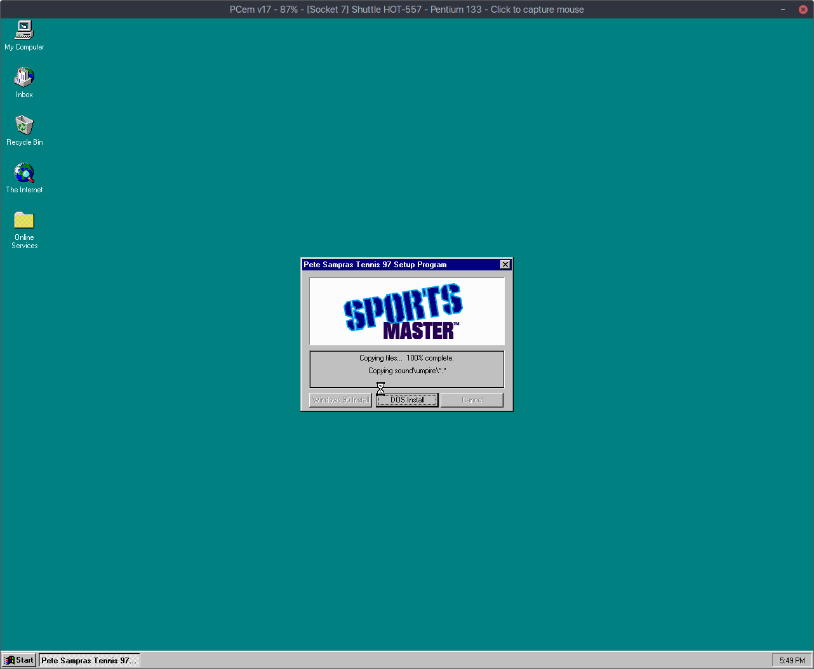
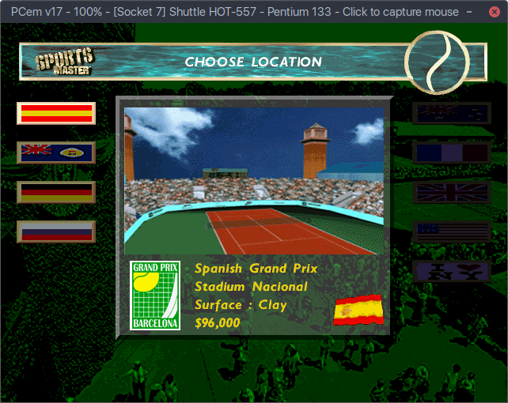

<iframe src="https://www.youtube-nocookie.com/embed/lAkuJXGldrM" frameborder="0" allow="accelerometer; autoplay; clipboard-write; encrypted-media; gyroscope; picture-in-picture" allowfullscreen></iframe>

Satu sore saya teringat dengan game masa kecil saya. Setelah saya telusuri di Google, game tersebut berjudul "Pete Sampras Tennis 97". Game pertama yang saya mainkan di komputer selain game balapan F1.

Saya akan gunakan PC emulator bernama [PCem](https://pcem-emulator.co.uk "PCem"). PCem bekerja sebagai emulator lengkap PC dengan banyak pilihan device. Tapi untuk bisa menggunakan harus download ROM. Saya unduh dari [PCem-ROMs](https://github.com/BaRRaKudaRain/PCem-ROMs "pcem-roms") dan saya letakkan di directory ~/.pcem/roms.

Selanjutnya untuk konfigurasi dan instalasi di PCem saya mengikuti tutorial dari [olistutorial blog](https://olistutorials.wordpress.com/2017/02/25/setting-up-pcem-for-windows-95-games/). Konfigurasinya adalah :

- [Socket 7] Shuttle HOT-557, Intel Pentium 333, 128 MB
- S3 ViRGE/DX, Voodoo Graphics: Voodoo2 4MB
- Sound Blaster AWE32

Sistem operasi yang saya pilih adalah Windows 95 OSR 2.5 dari tautan ini 
[Windows 95 CDs](https://winworldpc.com/product/windows-95/osr-3).
Saya gunakan *31795-OEM-0006627-29381* untuk kode product key.
Setelah beberapa kali restart akhirnya Windows 95 berhasil diinstall.

Langkah berikutnya adalah mengunduh CD ISO game dari tautan [myabandonware.com](https://www.myabandonware.com/game/pete-sampras-tennis-97-bwz#download). Kemudian mount ke slot CD. Setelah restart, game bisa dibuka melalui Start Menu > Programs > Codemasters. Kalau mau main game harus gunakan cd game di CD ROM slot.

Main game ini dengan menggunakan keyboard agak susah, karena tombol-tombol yang digunakan tidak biasa dan tidak bisa di-remap. Seperti ke kiri "x" dan kanan "v". Membawa kesenangan tersendiri bisa bermain game dari masa kecil.

Terima kasih telah membaca.
