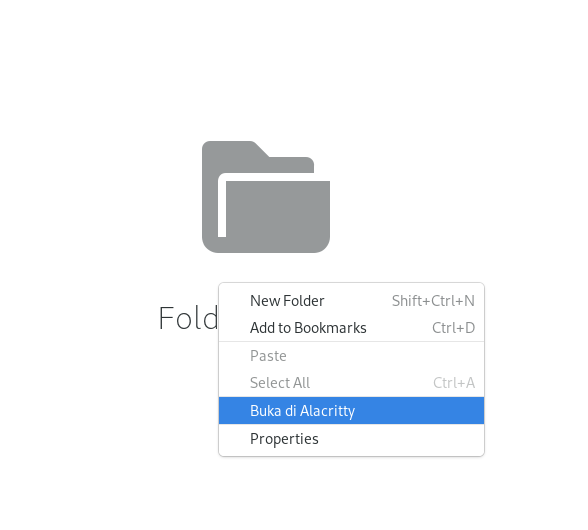

File Manager pada umumnya memiliki fitur ketika kita melakukan klik kanan, akan ada pilihan 'Open terminal here'. Pilihan tersebut akan membuka aplikasi default terminal dan memindahkan directory dimana kita melakukan klik kanan tersebut. Ada kalanya saya menggunakan terminal lain seperti Alacritty dengan command shell tmux.

Pada tulisan ini saya akan menggunakan [Nautilus Python Binding](https://wiki.gnome.org/Projects/NautilusPython) untuk menambahkan menu tambahan untuk membuka Alacritty terminal dan langsung membuat halaman baru dalam tmux.

### Setup
Kita mulai dengan menginstall paket:

```bash
sudo apt-get install python-nautilus
# atau
sudo dnf install nautilus-python
```

Buat directory baru di `~/.local/share/nautilus-python/extensions/`

### Kode

Buat file baru dengan nama buka-alacritty.py

```python
import os

from subprocess import call
from gi.repository import Gio, Nautilus, GObject

class BukaDiAlacritty(GObject.GObject, Nautilus.MenuProvider):
    def _call_alacritty(self, menu, file_):
         directory = Gio.File.new_for_uri(file_.get_uri()).get_path()
         invoke = f"alacritty --working-directory \'{directory}\' --command tmux new-window -c \'{directory}\'&"
         call(invoke, shell=True)
         call("wmctrl -xa Alacritty.Alacritty", shell=True)

    def get_background_items(self, window, file_):
        items = []
        item = Nautilus.MenuItem(
            name="BukaDiAlacritty::buka_directory",
            label="Buka di Alacritty",
             tip="",
        )
        item.connect("activate", self._call_alacritty, file_)
        items.append(item)
        return items
```

Pada variabel invoke, kita memanggil alacritty dengan argumen untuk mengubah directory serta memanggil perintah tmux. Pada call yang kedua, kita membuat window Alacritty menjadi fokus.


### Hasil
Tutup nautilus dan buka kembali maka akan muncul seperti ini ketika diklik kanan.
[](right-click.png)
