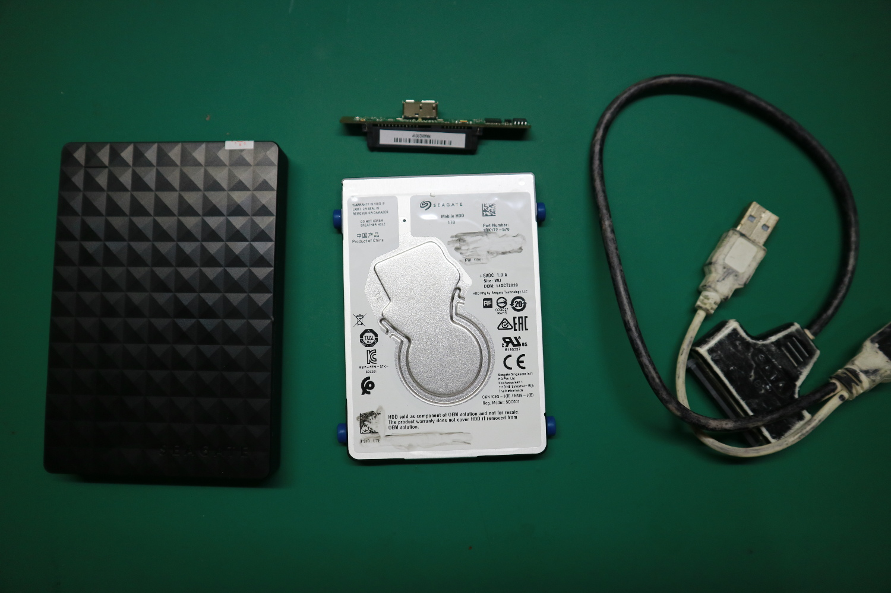

Suatu ketika saya menemukan laptop netbook lama saya. Saya yang dalam fase nostalgia lalu melakukan install ulang Windows XP tapi versi 2009 Embedded POSReady. Setelah sukses dengan proses install OS nya, lanjut driver drivernya yang dengan mudah saya dapatkan dari internet.

Selang tidak lama saya coba pasangkan harddisk external Seagate saya ke netbook tersebut. Saya mulai melakukan instalasi program-program umum yang saya butuhkan. Tiba-tiba muncul bunyi notifikasi aneh dari sistem. Ketika mengakses data menjadi lama dan akhirnya muncul warning I/O error.

Saya mulai panik. Saya coba aplikasi seperti Testdisk untuk membaca kembali struktur partisi, tidak bisa. Mencoba aplikasi AOMEI Partition Assistant untuk lakukan proses _Disk Surface Test_ dengan hasilnya kotak merah semua. Saya juga buka dengan aplikasi GParted di Linux, tapi partisinya tidak terbaca sama sekali.

Dari hasil tiga aplikasi diatas, saya berhipotesis bahwa yang kena adalah circuit boardnya. Saya kemudian mencoba membongkar case plastiknya untuk mengeluarkan hard disk tersebut. Saya pasangkan hard disk tadi dengan kabel SATA to USB yang saya punya. Ketika di pasangkan ke komputer ternyata masih sama, tidak terbaca.

Sampai disini cerita harddisk ini. Saya percaya data pada _platter_ fisiknya masih ada, tapi elektronik circuit boardnya yang kena. Mungkin suatu saat nanti saya ada dana dan waktu untuk mengirimnya ke spesialis perbaikan harddisk.

Data yang ada di dalamnya semua adalah data Master program-program yang sudah saya pisah per kategori. Data multimedia lainnya juga seperti musik dan filem-filem. Walaupun begitu tetap saja ada kegetiran dalam hati.

Sekian kisah ini saya tulis untuk menjadi penyembuhan bagi saya. Terimakasih telah membaca.
