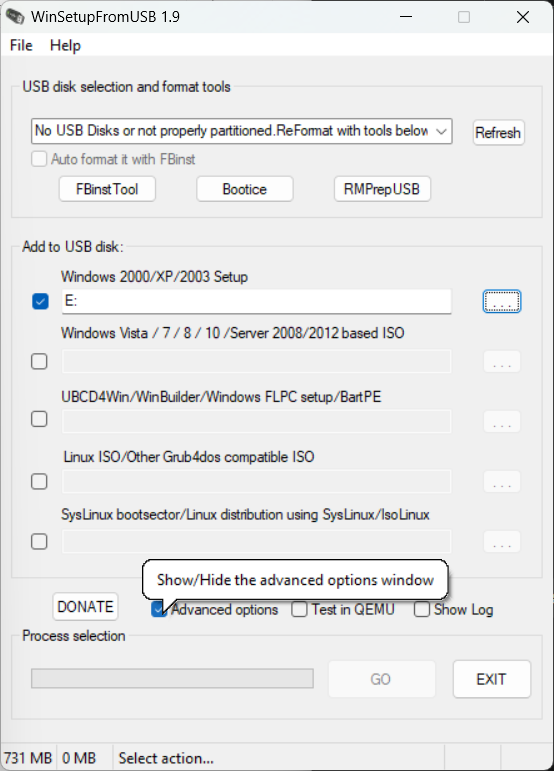
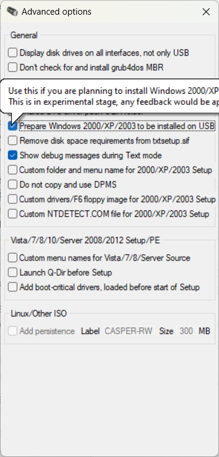
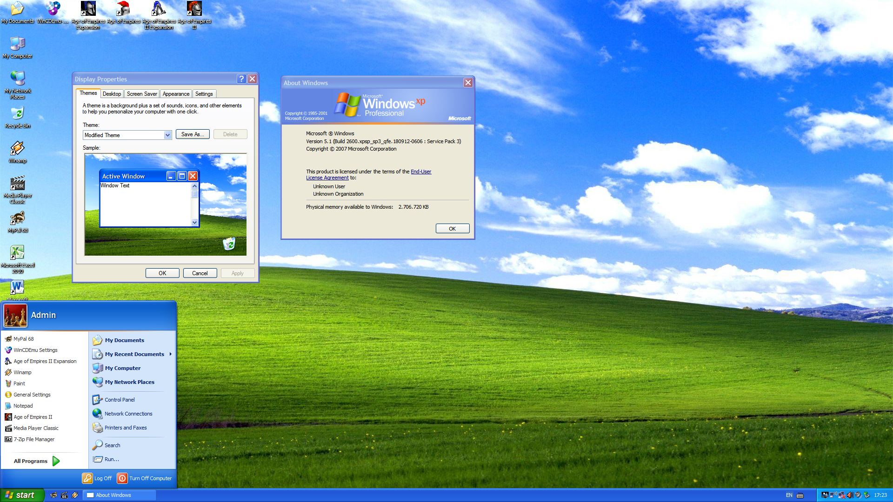
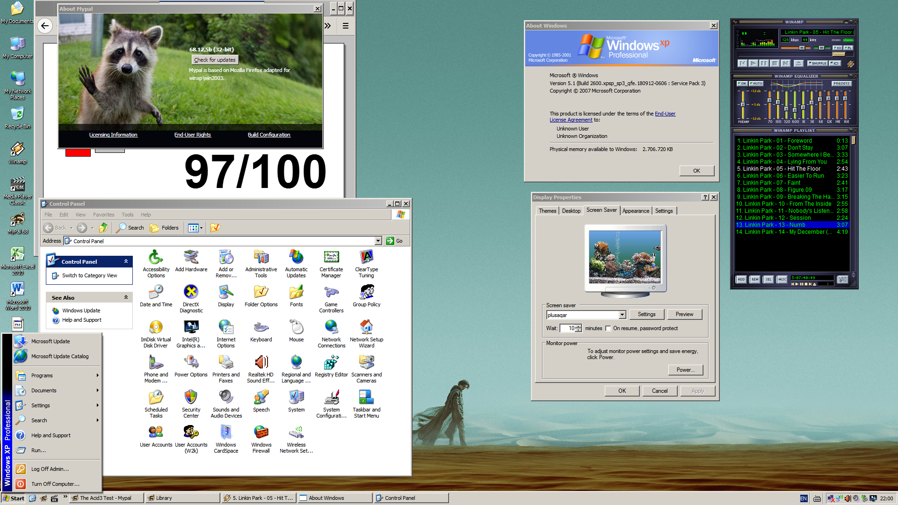

Banyak program untuk membuat sistem operasi Windows dapat diinstall ke flashdisk seperti Hasleo [WinToUSB](https://www.easyuefi.com/wintousb/). Windows sendiri juga punya fitur bernama [Windows To Go](https://learn.microsoft.com/en-us/windows/deployment/planning/windows-to-go-overview) tapi sekarang sudah tidak tersedia.
Window XP sekarang sudah tidak lagi disupport. Windows XP pertama kali dirilis tahun 2001. Terakhir disupport sampai tahun [2014](https://learn.microsoft.com/en-us/lifecycle/products/windows-xp) untuk versi POS Ready Embedded.

Ada banyak tutorial di internet  untuk ini seperti [Enderman](https://malwarewatch.org/documents/runwindowsxponusb.html).
Sebelum memulai kita akan menggunakan ISO Windows XP Integral Edition dari [zone94.com](https://zone94.com/downloads/software/operating-systems/123-windows-xp-professional-sp3-x86-integral-edition). Banyak patch dan updates yang dimasukkan secara manual. Dalam arsip itu ada pula program untuk kostumisasi setup nya. Beberapa pilihan driver SATA dan lain-lain. 

Setelah selesai kostumisasi ISO yang kita inginkan, kita akan menulis ISO tersebut ke flashdisk dengan program [WinSetupFromUSB](https://www.majorgeeks.com/files/details/winsetupfromusb.html).

- Mount ISO nya kemudian pilih drive nya.
- Centang menu **Advanced options**. 
- Centang **Prepare Windows 2000/XP/2003 to be installed on USB**.
- Klik Go.

Setelah selesai reboot PC anda. Matikan boot UEFI dan nyalakan boot mode BIOS (Legacy). Kalau bisa juga lepas/copot Hard Disk atau SSD yang ada sehingga flashdisk menjadi satu-satunya boot device. 
Cara itu adalah solusi setelah berulang-ulang muncul error. Tinggal lanjut setup XP seperti biasa.

Untungnya driver display dan sound untuk Windows XP masih disediakan oleh Lenovo pada situsnya.
Lanjut install Winamp dan Age of Empires II untuk pengalaman Windows XP yang autentik.

