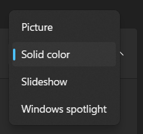
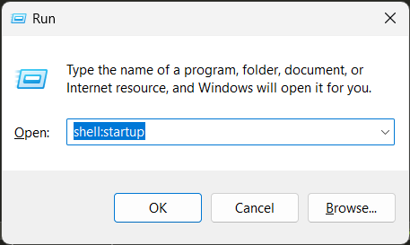
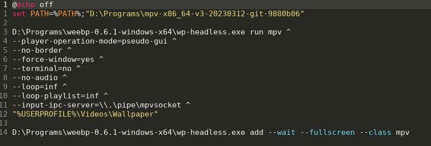

Sampai saat ini wallpaper di MS Windows belum bisa dimuat dari video.
Ada 4 pilihan berupa Pictures, Solid color, Slideshow, dan layanan Windows spotlight.
Satu-satunya cara untuk membuat video menjadi wallpaper adalah menggunakan software 3rd-party.
[](personalization-background.png)

Sepengetahuan saya ada beberapa software untuk ini antara lain:

- Wallpaper Engine (berbayar) yang tersedia di Steam.
- Lively Wallpaper: Opensource, beragam fitur seperti mengubah wallpaper dari sebuah website.


Saya ingin yang ringan, free, dan segampang di Linux dengan program `mpv`.

```
mpv --wid 0 --loop=inf VIDEO.mp4
```

Saya menemukan program [weebp](https://github.com/Francesco149/weebp) wallpaper engine sederhana. 
Setelah membaca contoh penggunaannya,  saya buat menjadi batch script dan saya taruh di startup folder.
Tidak lupa saya unduh [mpv](mpv.io) yang portable saja, karna saya sudah menggunakan VLC untuk kebutuhan nonton video.
Terakhir unduh video 'STATIC LOOP' untuh diputar.
[](win-r-shell-startup.png)

[](batch-script.png)

Ganti Background di Settings menjadi solid color, saya pilih hitam. Restart untuk melihat wallpaper anda menjadi hidup. Cheers
