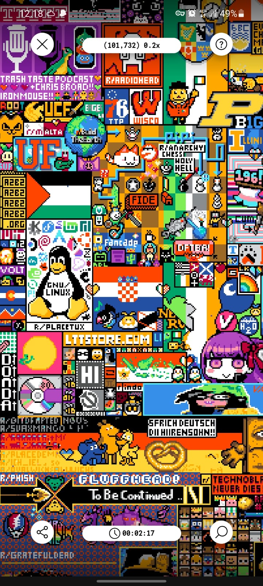

`r/place` is an online social experiment hosted on Reddit, launched on April Fools' Day in 2017, and repeated in 2022 and 2023. In this experiment, registered users could edit a digital canvas by placing colored pixels. Each user had to wait a specific time before placing another pixel.

In the heart of r/Indonesia, our Reddit community, we discovered the r/place experiment. With unwavering determination, we embarked on the mission to recreate Indonesia's flag in the 2022 edition. Through our coordinated efforts on Discord, strangers from different corners of Indonesia collaborated seamlessly, transcending time zones and challenges. Every pixel placed was a testament to our shared identity and dedication.

In the face of obstacles, we stood resilient. Random placements and rival groups attempted to hinder our progress, but our resolve only grew stronger. Our collective efforts paid off as the Indonesian flag emerged proudly on the digital canvas. Our triumph not only showcased our unity but also proved the extraordinary things that can happen when an online community comes together with a common purpose.

